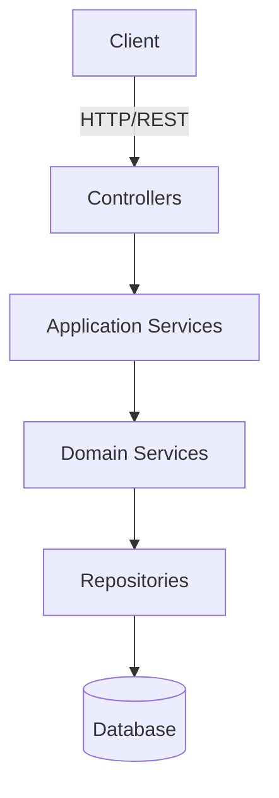
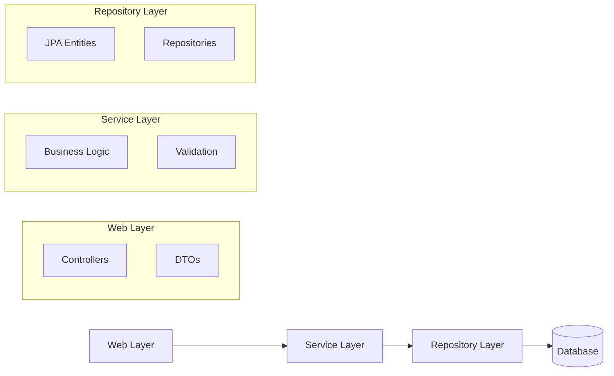

# Bank Management System

## Overview
This is a modern banking management system built with Spring Boot, following clean architecture principles and domain-driven design. The system provides comprehensive banking operations including account management, customer management, and transaction processing.

# Bank Management System

## Overview
This is a modern banking management system built with Spring Boot, following clean architecture principles and domain-driven design. The system provides comprehensive banking operations including account management, customer management, and transaction processing.

## System Architecture


## Component Diagram


## Features
- Account Management (Create, Update, Delete)
- Customer Management
- Transaction Processing
- Balance Inquiries
- Fund Transfers
- Transaction History
- Secure Authentication and Authorization

## Technology Stack
- Java 17
- Spring Boot 3.x
- Spring Data JPA
- Spring Security
- PostgreSQL
- Maven
- Docker
- JUnit 5
- Mockito
- Swagger/OpenAPI

## Getting Started

### Prerequisites
- JDK 17
- Maven 3.8+
- Docker (optional)
- PostgreSQL

### Running Locally
1. Clone the repository
```bash
git clone https://github.com/sr42-bit/bank-management-system.git
```

2. Navigate to project directory
```bash
cd bank-management-system
```

3. Build the project
```bash
mvn clean install
```

4. Run the application
```bash
mvn spring-boot:run
```

The application will be available at `http://localhost:8080`

### API Documentation
Swagger UI is available at `http://localhost:8080/swagger-ui.html`

## Project Structure
The project follows a clean architecture pattern with the following main components:

- `domain` - Core business logic and entities
- `application` - Use cases and port interfaces
- `infrastructure` - External frameworks and adapters
- `web` - REST API controllers and DTOs

## Contributing
1. Fork the repository
2. Create your feature branch (`git checkout -b feature/AmazingFeature`)
3. Commit your changes (`git commit -m 'Add some AmazingFeature'`)
4. Push to the branch (`git push origin feature/AmazingFeature`)
5. Open a Pull Request

## License
This project is licensed under the MIT License.

## Contact
Project Link: [https://github.com/sr42-bit/bank-management-system](https://github.com/sr42-bit/bank-management-system)
 bank-management-system/
│
├── .github/                                # GitHub Actions for CI/CD (build + test)
│   └── workflows/
│       └── ci.yml                          # CI pipeline with Maven, tests, Docker, etc.
│
├── docs/                                   # System design and architecture notes
│   └── architecture.md                     # Outline of how the system is structured
│
├── src/
│   ├── main/java/com/example/bank/
│   │   ├── BankManagementSystemApplication.java  # Main Spring Boot class
│   │   ├── domain/                                 # Core business logic
│   │   │   ├── model/                            # Pure Java models (Account, Customer)
│   │   │   │   ├── Account.java
│   │   │   │   ├── Customer.java
│   │   │   │   └── Transaction.java
│   │   │   └── service/                          # Business validation and services
│   │   │       └── DomainValidationService.java
│   │   ├── application/                         # Use cases (business logic handling)
│   │   │   ├── ports/                            # Inbound and outbound interfaces
│   │   │   │   ├── in/
│   │   │   │   │   ├── CreateAccountUseCase.java
│   │   │   │   │   └── TransferFundsUseCase.java
│   │   │   │   └── out/
│   │   │   │       ├── AccountRepository.java
│   │   │   │       ├── CustomerRepository.java
│   │   │   │       └── TransactionRepository.java
│   │   │   └── service/                         # Service implementations
│   │   │       ├── CreateAccountService.java
│   │   │       └── TransferFundsService.java
│   │   ├── infrastructure/                      # External frameworks and adapters
│   │   │   ├── config/                          # Spring configurations
│   │   │   │   └── BeanConfiguration.java
│   │   │   ├── persistence/                     # Database configuration
│   │   │   │   ├── entity/                      # JPA Entities
│   │   │   │   │   ├── AccountJpaEntity.java
│   │   │   │   │   ├── CustomerJpaEntity.java
│   │   │   │   │   └── TransactionJpaEntity.java
│   │   │   │   ├── repository/                  # JPA Repositories
│   │   │   │   │   ├── AccountJpaRepository.java
│   │   │   │   │   ├── CustomerJpaRepository.java
│   │   │   │   │   └── TransactionJpaRepository.java
│   │   │   │   ├── adapter/                     # Adapters to implement repositories
│   │   │   │   │   ├── AccountRepositoryAdapter.java
│   │   │   │   │   ├── CustomerRepositoryAdapter.java
│   │   │   │   │   └── TransactionRepositoryAdapter.java
│   │   │   │   └── exception/                   # Global exception handler
│   │   │   │       └── GlobalExceptionHandler.java
│   │   │   └── web/                             # API layer (Controllers)
│   │   │       ├── controller/
│   │   │       │   ├── AccountController.java
│   │   │       │   ├── CustomerController.java
│   │   │       │   └── TransactionController.java
│   │   │       ├── dto/                         # Data Transfer Objects
│   │   │       │   ├── AccountRequestDto.java
│   │   │       │   ├── TransferRequestDto.java
│   │   │       │   ├── CustomerRequestDto.java
│   │   │       │   └── TransactionResponseDto.java
│   │   │       └── mapper/                      # Map models to DTOs
│   │   │           └── AccountMapper.java
│   ├── resources/
│   │   ├── application.properties                # General Spring Boot configuration
│   │   ├── application-dev.properties           # Environment-specific settings (Dev)
│   │   ├── application-prod.properties          # Production environment settings
│   │   ├── schema.sql                          # Database schema (optional)
│   │   ├── data.sql                            # Optional sample data
│   │   └── db/changelog/                       # Flyway/Liquibase DB migrations
│   │       └── changelog.sql
│   └── test/
│       ├── java/com/example/bank/
│       │   ├── unit/                             # Unit tests
│       │   │   └── AccountServiceTest.java
│       │   ├── integration/                     # Integration tests
│       │   │   └── AccountControllerTest.java
│       └── resources/
│           └── application-test.properties      # Test-specific configurations
│
├── pom.xml                                     # Maven configuration
├── README.md                                   # Project documentation
└── target/ or build/                           # Auto-generated after build
