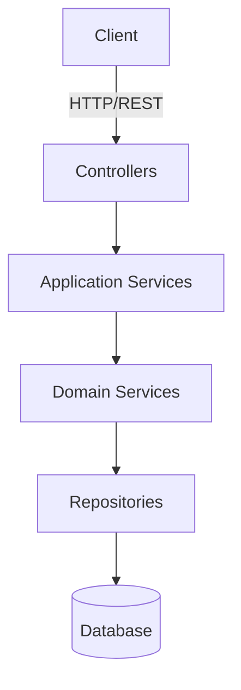
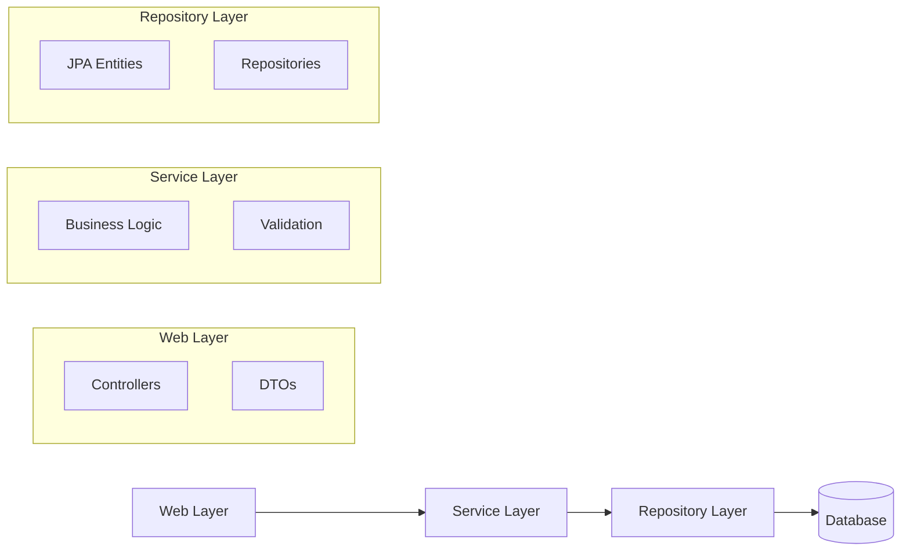

# Bank Management System

## Overview
This is a modern banking management system built with Spring Boot, following clean architecture principles and domain-driven design. The system provides comprehensive banking operations including account management, customer management, and transaction processing.

# Bank Management System

## Overview
This is a modern banking management system built with Spring Boot, following clean architecture principles and domain-driven design. The system provides comprehensive banking operations including account management, customer management, and transaction processing.

## System Architecture

```mermaid
graph TD
    A[Client] -->|HTTP/REST| B[Controllers]
    B --> C[Application Services]
    C --> D[Domain Services]
    D --> E[Repositories]
    E --> F[(Database)]
```

## Component Diagram

```mermaid
graph LR
    A[Web Layer] --> B[Service Layer]
    B --> C[Repository Layer]
    C --> D[(Database)]
    
    subgraph Web Layer
    E[Controllers]
    F[DTOs]
    end
    
    subgraph Service Layer
    G[Business Logic]
    H[Validation]
    end
    
    subgraph Repository Layer
    I[JPA Entities]
    J[Repositories]
    end
```

## Features
- Account Management (Create, Update, Delete)
- Customer Management
- Transaction Processing
- Balance Inquiries
- Fund Transfers
- Transaction History
- Secure Authentication and Authorization

## Technology Stack
- Java 17
- Spring Boot 3.x
- Spring Data JPA
- Spring Security
- PostgreSQL
- Maven
- Docker
- JUnit 5
- Mockito
- Swagger/OpenAPI

## Getting Started

### Prerequisites
- JDK 17
- Maven 3.8+
- Docker (optional)
- PostgreSQL

### Running Locally
1. Clone the repository
```bash
git clone https://github.com/sr42-bit/bank-management-system.git
```

2. Navigate to project directory
```bash
cd bank-management-system
```

3. Build the project
```bash
mvn clean install
```

4. Run the application
```bash
mvn spring-boot:run
```

The application will be available at `http://localhost:8080`

### API Documentation
Swagger UI is available at `http://localhost:8080/swagger-ui.html`

## Project Structure
The project follows a clean architecture pattern with the following main components:

- `domain` - Core business logic and entities
- `application` - Use cases and port interfaces
- `infrastructure` - External frameworks and adapters
- `web` - REST API controllers and DTOs

## Contributing
1. Fork the repository
2. Create your feature branch (`git checkout -b feature/AmazingFeature`)
3. Commit your changes (`git commit -m 'Add some AmazingFeature'`)
4. Push to the branch (`git push origin feature/AmazingFeature`)
5. Open a Pull Request

## License
This project is licensed under the MIT License.

## Contact
Project Link: [https://github.com/sr42-bit/bank-management-system](https://github.com/sr42-bit/bank-management-system)
 bank-management-system/